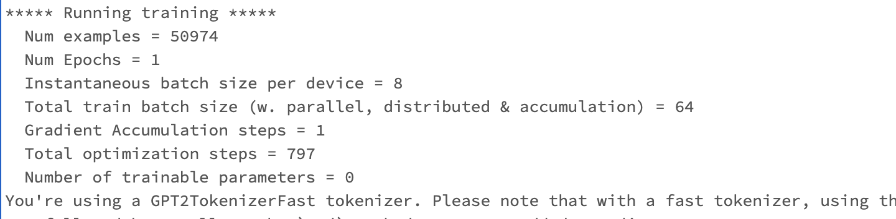
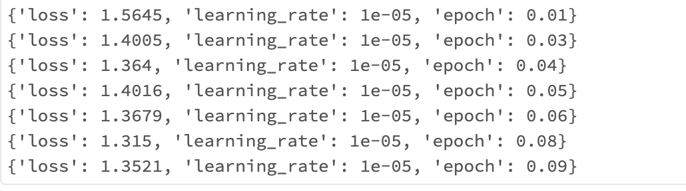
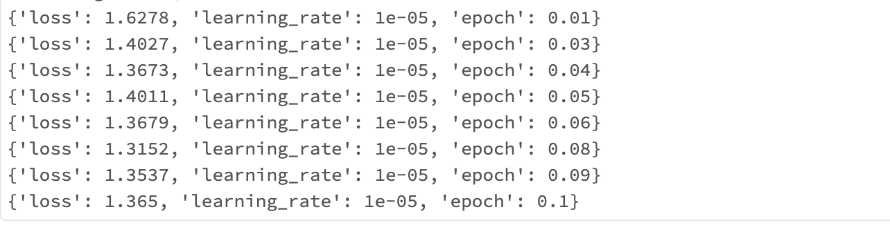

# finetune_dolly


## Getting Started with Training

First of all, Add the `dolly` repo to Databricks. 
  - move your cursor to the left on Databricks to see Repo. Under Repos click Add Repo, enter `https://github.com/databrickslabs/dolly.git`, then click Create Repo. 

### V100 GPUs

Start a `12.2 LTS ML (includes Apache Spark 3.3.2, GPU, Scala 2.12)` single-node cluster with node type having 8 V100 instances with 32GB of GPU memory (ex: `p3dn.24xlarge`, note that you must select the GPU runtime first, and unselect "Use Photon", for these instance types to appear), then make the following changes to your added repo, Databricks automatically save them after you make changes:
-  Modify the deepspeed config file `config/ds_z3_bf16_config.json` to configure optimizer offload. Within the `"zero_optimization"` section, add:
    ```
    "offload_optimizer": {
      "device": "cpu",
      "pin_memory": true
    },
   ```
- Modify `training/trainer.py` to disable `bf16` and enable `fp16` in `TrainingArguments`:
  ```
  ...
  fp16=True,
  bf16=False,
  ...
  ```
- Open the `train_dolly` notebook in the Repo (which is the `train_dolly.py` file in the Github `dolly` repo). Set the `num_gpus` widget in `train_dolly` to the number of GPUs in your instance, typically 8. There will be three popup window (widget) on the top of the screen when you are in `train_dolly` notebook. You want to fill in the number 8 in the `num_gpus` window. You don't need to set the `dbfs_output_root` and `local_training_root` widget because the code will detect if these are Null, then they are set by default to `"dolly_training"`.

- Attach the notebook to your GPU cluster, that is, over the top right of your screen, select your cluster. 
- Run all cells.  When training finishes, the notebook will save the model under `/dbfs/dolly_training` by default. It takes around 2 minutes to download and install all the dependencies before actually starting training. 

- In the cell that contains the following code is where you actually initiate training:
  ```
  !deepspeed {num_gpus_flag} \
    --module training.trainer \
    --deepspeed {deepspeed_config} \
    --epochs 1 \
    --local-output-dir {local_output_dir} \
    --dbfs-output-dir {dbfs_output_dir} \
    --per-device-train-batch-size 8 \
    --per-device-eval-batch-size 8 \
    --lr 1e-5
  ```
Don't forget that You can click the cell output to scroll inside the output cell. Here are the details of the output for the above code (If you also have the Py4JNetworkError, it's probably caused by low spark.driver.memory and spark.executor.memory just from my personal perspective. This error doesn't prevent the code running):

- it first loads the tokenizer and the model and takes around 5 minutes to download the "pytorch_model.bin"
- After initializing the optimizer, configs and hyperparameters are printed 

  
- Here is how the loss is updating, this single cell block takes 27.89 minutes to run about 0.1 epoch before I terminated the process.
  

  
 ### A100 GPUs
 
 To run in A100 GPUs setting, you don't need to change anything in the repo. That means, if you modified the deepspeed config file `config/ds_z3_bf16_config.json` and `training/trainer.py`, change it back to the original. 
 
 - Start a `12.2 LTS ML (includes Apache Spark 3.3.2, GPU, Scala 2.12)` single-node cluster with node type having 8 A100 GPUs (e.g. `p4d.24xlarge`). Note you must select the GPU runtime first, and unselect "Use Photon", for these instance types to appear (where supported).

- Open the `train_dolly` notebook in the Repo (which is the `train_dolly.py` file in the Github `dolly` repo), attach to your GPU cluster, and run all cells.  When training finishes, the notebook will save the model under `/dbfs/dolly_training`.

- Here is how the loss is updating, the deepspeed single cell block takes 9.07 minutes to run about 0.1 epoch before I terminated the process.
 
 
